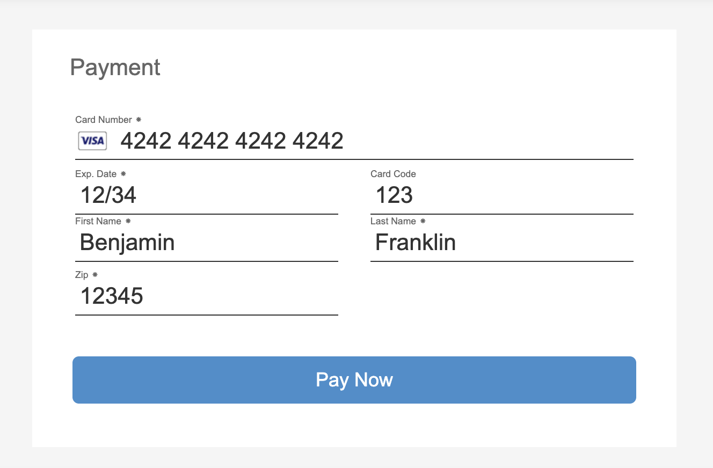

# ReactAuthnetIFrame

A lightweight, modern React implementation of Authorize.net's Accept.JS library that provides seamless payment integration with embedded iframe functionality.

## Overview

ReactAuthnetIFrame is an npm package that offers a React component for easily submitting payments to the Authorize.net platform. Unlike traditional pop-up implementations, this component embeds the payment iframe directly into your page, providing a more integrated and user-friendly experience.



## Key Features

- **Embedded iframe**: Seamlessly integrates payment forms directly into your page layout
- **Lightweight**: Minimal bundle size for optimal performance
- **Modern React**: Built with modern React patterns and hooks
- **Authorize.net Integration**: Direct integration with Authorize.net's payment processing
- **Customizable**: Easy to style and integrate with your existing design system

## Why ReactAuthnetIFrame?

Traditional Authorize.net implementations often use pop-up windows or redirects, which can:
- Disrupt the user experience
- Create security concerns with pop-up blockers
- Break the flow of your application

ReactAuthnetIFrame solves these issues by:
- Embedding the payment form directly in your page
- Maintaining consistent styling and user experience
- Providing seamless integration with your React application

## Installation

```bash
npm install react-authnet-iframe
```

## Usage

```jsx
import { ReactAuthnetIFrame, SANDBOX } from 'react-authnet-iframe';

function PaymentPage() {
  const handlePaymentSuccess = (response) => {
    console.log('Payment successful:', response);
  };

  const handlePaymentError = (error) => {
    console.error('Payment failed:', error);
  };

  return (
    <div>
      <h1>Complete Your Purchase</h1>
      <ReactAuthnetIFrame
        apiLoginID="your_api_login_id"
        clientKey="your_client_key"
        environment={SANDBOX}
        onSubmit={handlePaymentSuccess}
        onError={handlePaymentError}
        acceptUIFormBtnTxt="Complete Payment"
        acceptUIFormHeaderTxt="Payment Information"
        billingAddressOptions={{ show: true, required: false }}
        paymentOptions={{ showCreditCard: true, showBankAccount: false }}
      />
    </div>
  );
}
```

## Configuration Options

The ReactAuthnetIFrame component accepts the following configuration options to customize the payment experience:

### Required Parameters
- `apiLoginID` (string): Your Authorize.net API Login ID
- `clientKey` (string): Your Authorize.net Client Key

### Optional Parameters

#### Callback Functions
- `onSubmit` (function): Callback function for successful payments
  - Default: `(r) => console.log('AuthnetFrame response:', r)`
- `onError` (function): Callback function for payment errors
  - Default: `(e) => console.error('AuthnetFrame error:', e)`

#### Environment
- `environment` (string): Payment environment to use
  - Values: `'SANDBOX'` (default) or `'PRODUCTION'`
  - Import constants: `import { SANDBOX, PRODUCTION } from 'react-authnet-iframe'`

#### UI Customization
- `acceptUIFormBtnTxt` (string): Custom text for the payment button
  - Default: `'Pay Now'`
- `acceptUIFormHeaderTxt` (string): Custom header text for the payment form
  - Default: `'Payment'`

#### Billing Address Options
- `billingAddressOptions` (object): Configuration for billing address fields
  - `show` (boolean): Whether to display billing address fields
    - Default: `false`
  - `required` (boolean): Whether billing address is required
    - Default: `true`

#### Payment Options
- `paymentOptions` (object): Configuration for payment method display
  - `showCreditCard` (boolean): Whether to show credit card payment option
    - Default: `true`
  - `showBankAccount` (boolean): Whether to show bank account payment option
    - Default: `false`

## Development

This project is built with modern React and follows best practices for component development. The component is designed to be lightweight while providing robust payment functionality.

## Contributing

Contributions are welcome! Please feel free to submit a Pull Request.

## License

[License information to be added]

## Support

For support and questions, please open an issue on the project repository.
